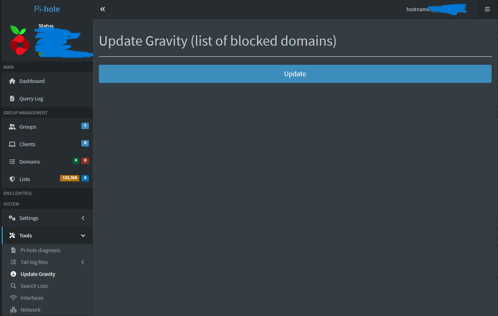

# Pi-hole DNS Sinkhole – Homelab Project

## 🔧 Project Overview
Deployed Pi-hole on a Raspberry Pi to act as a DNS sinkhole and block ads and trackers across my home network.  
This project helped me learn the basics of DNS, network-level security, and managing a Linux-based server.


## 📚 What I Learned
- How DNS resolution works
- What a DNS sinkhole is
- How Pi-hole blocks unwanted traffic
- Linux service management
- Static IP setup and firewall rules


## 🔑 Skills Demonstrated
- DNS and network fundamentals
- Linux system administration
- Static IP and DHCP configuration
- Firewall rules (UFW)
- Web-based admin tools
- Security and ad-blocking at the network level


## 🛠️ Tools & Technologies
- Raspberry Pi 5 8gb (can be done on any other linux machine)
- Pi-hole
- Ubuntu Server 22.04
- UFW (firewall)
- Web UI for Pi-hole


## ⚙️ Setup Steps
I will be setting up a pi-hole DNS server on my raspberry pi 5 that will act as a DNS sinkhole for my whole network, blocking any ads on the sites, or any malicious sites I could open on accident.

### Setting up a static IP address
First, I upgraded my packages to make sure everything is up to date
```sh
sudo apt update && sudo apt upgrade
```
Now, I need to set a static IP address to my raspberry pi, because otherwise its IP may reset next time I restart my router, and every device trying to access the old IP as the DNS server will fail to access the web.

There are 2 ways I could set a static IP: either set a DHCP reservation in my router, or set in my raspberry pi. I will do the latter.

Before configuring anything in my dhcpcd.conf, I need to find the range where I could set my static IP address. This has to be found individually for everyone, because **if you don't know the range of IPs that DHCP gives out to the clients, then you could assign a static IP that conflicts with IPs that are automatically assigned.**

I need to find x and y in `192.168.x.y` that I can safely assign to my raspberry pi.

Run
```sh
ip -4 addr show wlan0
```
<small>*(-4 means that it will show only ipv4 addresses, and wlan0 is my network)*</small>

Here's what I got:
```sh
$ ip -4 addr show wlan0
3: wlan0: <BROADCAST,MULTICAST,UP,LOWER_UP> mtu 1500 qdisc fq_codel state UP group default qlen 1000
    inet 192.168.4.XXX/22 metric 600 brd 192.168.X.XXX scope global dynamic wlan0
       valid_lft 10958sec preferred_lft 10958sec
```
**192.168.4.XXX** is the IP dynamically assigned within my subnet. I only care about the **4** in `192.168.4.X` because it identifies the subnet block that will be shared by my other clients.

To find the **y** I can use in my static IP, I need to go to my router settings and find the DHCP range. This range can be found in a routers settings. I have an *eero* router, and it doesn't show the range by default. In my case I had to choose "manual" in dhcp options and see the IP range that it sets by default there.


And only now after finding the available IP addresses, I'm going to configure my netplan config file (netplan is the default network configuration tool on ubuntu)
```sh
sudo nvim /etc/netplan/50-cloud-init.yaml
```
Added this to my wlan0 section (could be changed to eth0 if I switch to ethernet in the future):
```sh
wlan0:
  optional: true
  dhcp4: no
  addresses:
    - 192.168.4.10/22
  nameservers:
    addresses:
      - 192.168.4.1
      - 8.8.8.8
      - 1.1.1.1
  routes:
    - to: default
      via: 192.168.4.1
```
then apply the changes with
```sh
sudo netplan apply
```
And so my static IP address is changed to `192.168.4.10`

### Installing Pi-hole

Run this command and go through the installation process, press yes to everything, privacy mode to anonymous, use **CloudFlare** as the Upstream DNS Provider, as it's the fastest.
```sh                         
curl -sSL https://install.pi-hole.net | bash
```

For some reason, lighttpd, the package that handles Pi-holes web interface wasn't installed with Pi-hole, so I installed it manually.
```sh
sudo apt update
sudo apt install lighttpd -y
sudo systemctl enable lighttpd
sudo systemctl start lighttpd
```
<br/>
After installation, I allowed all the [necessary ports](https://docs.pi-hole.net/main/prerequisites/)  for Pi-hole using UFW because this is the default firewall for ubuntu host of my version.
```sh
sudo su
```

```sh
ufw allow 80/tcp
ufw allow 443/tcp
ufw allow 53/tcp
ufw allow 53/udp
ufw allow 67/tcp
ufw allow 67/udp
ufw allow 123/udp
sudo ufw reload # apply changes
```

Now I can finally <span id="panel"> go to the web interface </span>of Pi-hole by going to `static-ip-of-raspberry/admin` in my browser, which in my case is `192.168.4.10/admin`. There I used the password I assigned to with `sudo pihole setpassword MY_PASSWORD` 


### Configuring Pi-hole and router
Login to the [admin panel](#panel).  Go to the lists section.


In this section I will be adding block lists from the site https://firebog.net. Copy a few links from the site (preferably the green ones because they are guaranteed to not slow down the connection), and for each of them paste the address to Add a new subscribed list -> Address and then click "Add blocklist" (all of these are visible on the screenshot). Make sure all of them are checked and then go to Tools -> Update Gravity and click Update (on the screenshot). It will refresh all the blocklist and whitelist information.



Now, after everything's set up, go to the router's settings, go to the DNS configuration, choose custom DNS, use Pi-hole's machine static IP address, and for the secondary put `1.1.1.1` or default ISP IPv4 DNS (the speed difference is not that high, and may vary for different sites, but in my case, my ISP's IPv4s are a little faster)


### Testing
Now when everything's set up it's time to test.

Open pwsh or a terminal on another device and call these functions (using github as an example)
for pwsh:
```
Measure-Command { Resolve-DnsName youtube.com -Server 192.168.4.10 }
Measure-Command { Resolve-DnsName github.com -Server 1.1.1.1 }
```

for linux:
```sh
dig @192.168.4.10 github.com | grep "Query time"
dig @1.1.1.1 github.com | grep "Query time"
```

<small>(for context, 1.1.1.1 is CloudFlare's public DNS resolver, one of the fastest in the world)</small>

I'm testing it on windows and here is my output:
```
> Measure-Command { Resolve-DnsName youtube.com -Server 192.168.4.10 }
...
TotalMilliseconds : 16.6252

> Measure-Command { Resolve-DnsName github.com -Server 1.1.1.1 }
...
TotalMilliseconds : 14.5075
```

The speed (ms) could be a little different, but it should be around the same.
If the speed of Pi-hole is *really* slow (50+ ms), this is most likely due to the raspberry pi using wlan0(wifi connection). I would look into buying an ethernet cable in this case, or if it's not possible, don't use Pi-hole at all because it will just make the experience slower. If it's absolutely needed, there are things like *Parallel Upstream Lookups and preloading popular domains*, which could squeeze out a *few* extra milliseconds in some cases.
</br>
</br>
</br>
Congratulations, the Pi-hole is finally set up and you can browse the internet without seeing ads or stumbling upon malicious websites ever again.


## 🗂️ Resources
- [Pi-hole Docs](https://docs.pi-hole.net/)
- [DNS Sinkhole Explained](https://en.wikipedia.org/wiki/DNS_sinkhole)
- [Block Lists](https://firebog.net)
# LAB-Pi-Hole
